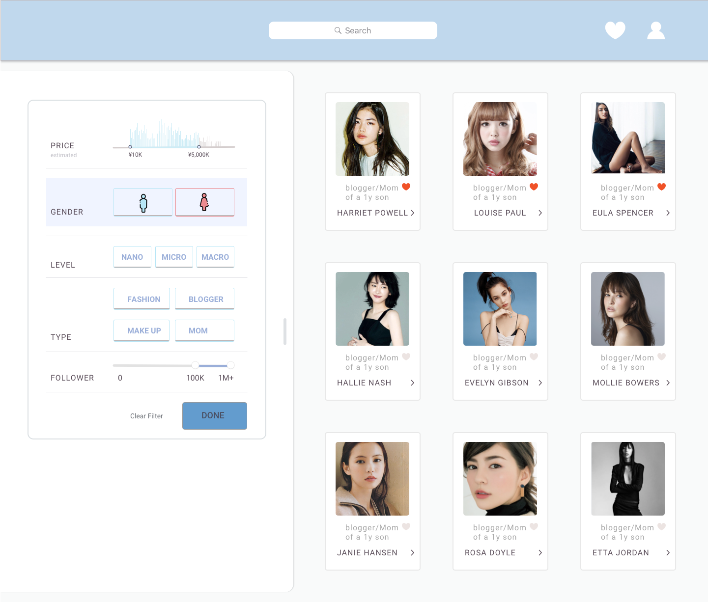
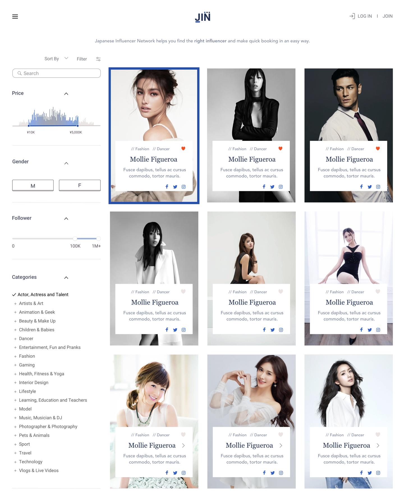
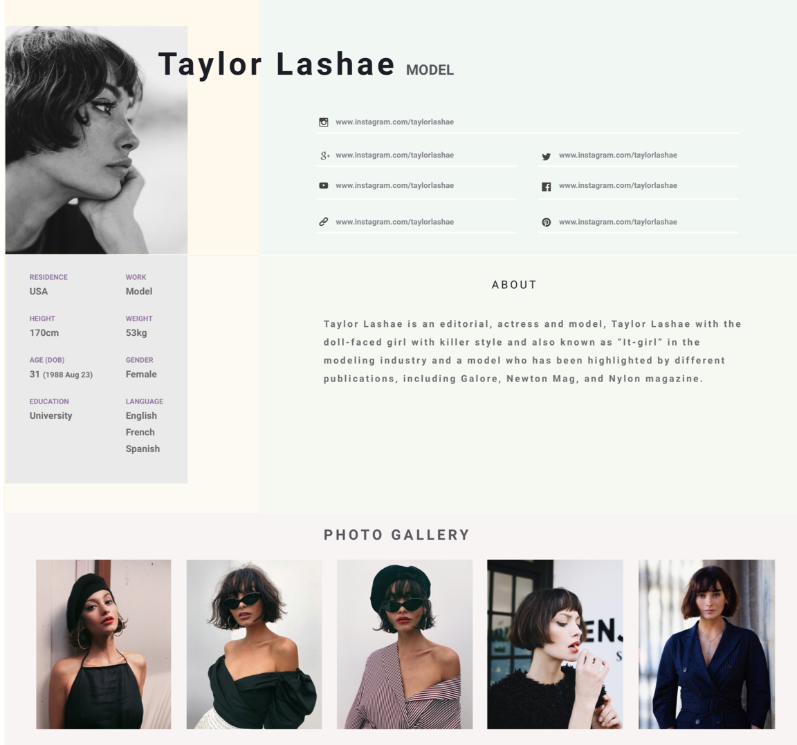
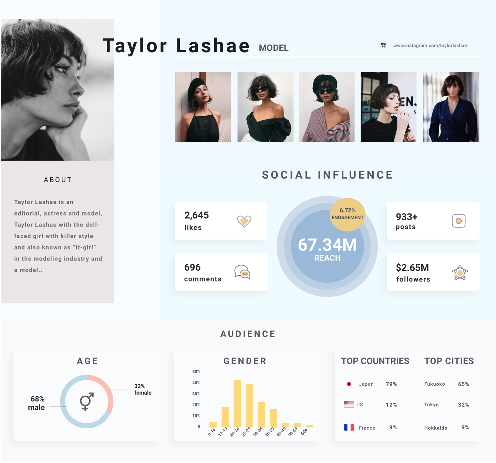
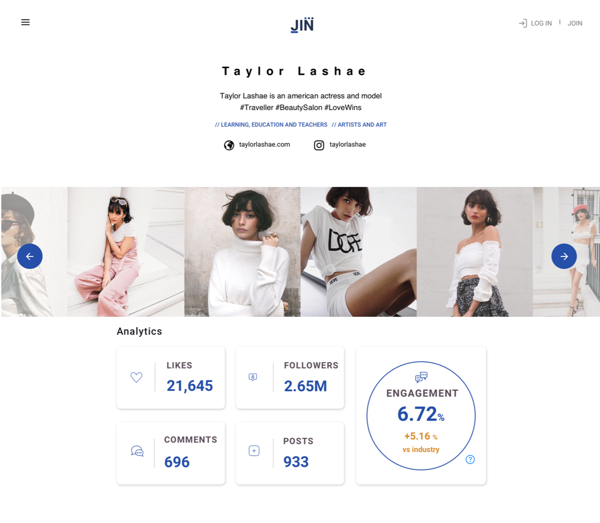

#### JIN, Japan Influencer network, is the first network platform connects influencers and advertising agencies.

When my partner Raphael, who is a back-end developer, reached me out and suggested that maybe we could make a fast prototyping of this influencer search function and show to the advertising agency we know in Tokyo. I was like, "Sure, it sounds cool!"

I enjoyed the project a lot and walked through the whole phase of design, including UI/UX and front-end (HTML, CSS, JS), it was a super valuable and fun experience!

#### Choose MVP wisely to test the market

The idea was to create a platform for advertising agencies to find the right influencer on Instagram and to make a booking accordingly. Most of the in-house search function in the Japan advertising industry is outdated. We would like to provide an easy booking services with better user experience.

Since the production time is merely 1 month, we selected search page and user profile page first to test out the market.

---

### From a single search to a complete filter function

At first, the user profile page has only have the text with pictures. To include more information and make it easier for users to see the actual info instead of just general information. I make the second design with visualized data.

#### 1st design

#### 2nd design

### Final design of search & filter page

### How I visualized influencer profile

At first, the user profile page has only have contents with pictures. To include more information and make it easier for users to see the actual info instead of just general information. I make the second design with visualized data.

#### 1st design

#### Improvement with visualized data

## Final design of user profile page

### Take away

1.  **Select MVP** - It is important to select MVP, make a quick design with user testing, and develop it. It saved us much time not thinking too much about landing page, booking page and others.

2.  **Don't seek for perfection** - I know, I know, designers often wants to make designs pixel perfect, so am I. I found myself ended up spending lots of time fixing minor things. Funny things is that the client, and the user doesn’t really mind what I cared much. It taught me not to get trapped but do more testing on the midway.

3.  **Know if customers really want it** - We did a lot of research but miscalculate the willingness to purchase the service from our initial client. It seems promising according to our sales contact, but later on, the client weren’t as interested as before. Our sales contact is still trying to find the buyer in Japan. We learnt that it is better to have at least a buyer pays for the services before jumping in too fast. However, Raphael and I both enjoyed and learnt a lot from it.

 

 

  
<a href='/dribbble-hightlight'>
       UI highlights on DRIBBBLE &#8594; 
      </a>

