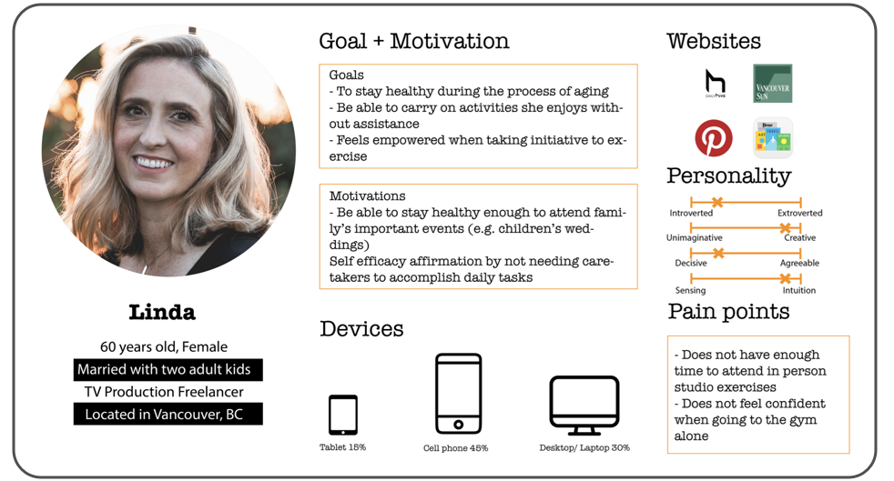
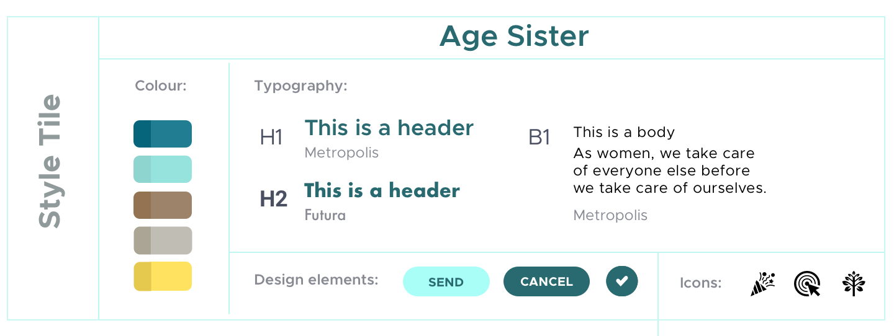

---

<h6 style=" font-size: 16px; margin-bottom:-30px; text-transform:uppercase">
BRIEF </h6>

<h3 style="margin-bottom:20px; text-transform:uppercase">
REDESIGN USER EXPERIENCE TO MAKE IT ACCESSIBLE FOR USERS OVER 50</h3>

> As women, we take care of everyone else before we take care of ourselves. When we move into our 50s and beyond, self-care is more important than ever before.
>
> — Kate Milne, the founder of Age Sister

Ageing is happening every day, but we usually ignore it. Kate Milne noticed that women, especially aged from 50 to 70 years old, are among the most under-served population. She started Age Sister, a health consultancy firm, in Vancouver to help women ageing in a happier and healthier way.

---

<h6 style=" font-size: 16px; margin-bottom:-30px; text-transform:uppercase">
Research Process </h6>

<h3 style="margin-bottom:20px; text-transform:uppercase">
DEFINE AND UNDERSTAND USERS' BEHAVIORS </h3>

#### DOMAIN RESEARCH

1. <b>Only 15%</b> of women at all ages meet the PE guidelines.
2. Women between 50 and 70 years old are <b>under-served</b>.
3. Women during menopause have an increased risk of developing <b>cardiovascular diseases.</b>
4. Lifestyle intervention can reverse the effect.
5. It links physical inactivity to <b>premature mortality</b>.
6. PE can delay age-related diseases, such as Alzheimer’s and Parkinson’s.
7. <b>Self-efficacy, intention, and depression</b> link to PE.
8. <b>Social and structured inequality</b> affects how much PE and exercise an older adult is getting.

<h6 style=" font-size: 16px; margin-bottom:-30px; text-transform:uppercase">
survey </h6>

<h3 style="margin-bottom:20px; text-transform:uppercase">
find out the behaviour of users</h3>

We sent out the survey and received 20+ responses, from the survey we have some key findings.

1. Know that we need to focus are woman aged 50 to 60 years old
2. User frequency mobile > desktop > iPad
3. Visual, font side, interface are important especially for women with certain disabilities

---

<h6 style=" font-size: 16px; margin-bottom:-30px; text-transform:uppercase">
user persona </h6>

<h3 style="margin-bottom:20px; text-transform:uppercase">
They need support to age healthily</h3>

After the busy Christmas, Linda finally has time to sit down and reflect on what she has done during this year. After the reflections, Linda wrote a list of things she wants to accomplish next year. She wants to have more time for her own, try to eat out less and cook more and to exercise more…

#### MOTIVATION AND PAIN POINT OF USERS

- Highly motivated to exercise to overcome physical discomfort
- The lack of the support group in their life circle makes them feel lonely
- Users are also looking for a right way working out

---

<h6 style=" font-size: 16px; margin-bottom:-30px; text-transform:uppercase">
design Process </h6>

<h3 style="margin-bottom:70px; text-transform:uppercase">
empathize the users' needs and likings </h3>

<h6 style=" font-size: 16px; text-transform:uppercase">
mood board </h6>

There are two mood boards for the client. The brownish-yellow colours help the whole website pop up visually with <b>a vibrant atmosphere</b> while the blue version on the right <b>conveyed a resilient feeling</b>.  
Age Sister would like to present a happy and revitalized vibe to gladden users. Therefore, the brownish-yellow serve as the final decision.

---

<h6 style=" font-size: 16px; margin-bottom:-30px; text-transform:uppercase">
logo process </h6>

<h3 style="margin-bottom:20px; text-transform:uppercase">
embody the dynamic and fluidity of femininity </h3>

I want to make a dynamic logo with feminine gestures. There are several variations in the logo design. We can reorganize the elements of logo that changed in several ways, make it a changable and adaptable.

<h6 style=" font-size: 16px; margin-bottom:-30px; text-transform:uppercase">
style tile</h6>

<h3 style="margin-bottom:20px; text-transform:uppercase">
a good branding is its consistency</h3>

<b>Colours</b> | Teal, brownish and yellow colour palette provides a energetic and healthy tone.  
<b>Typography</b> | Metropolis and Futura are both minimalistic san-serif font that give a neat feeling. They were chosen for the accessibility reason. It is easier for elders to read at either small or large font size. 
<b>Design Elements</b> | I added CTA (Call To Action) buttons with a bright colour so it can pop and stand out.

---

#### Wireframes

---

#### Final Design

 

  

  

  <a href='/kindrednotes'>
    <b>&#8592; KINDREDNOTES</b>
  </a>

<a href='/sage-foundation'>
       <b>Sage Foundation</b> &#8594; 
      </a>

