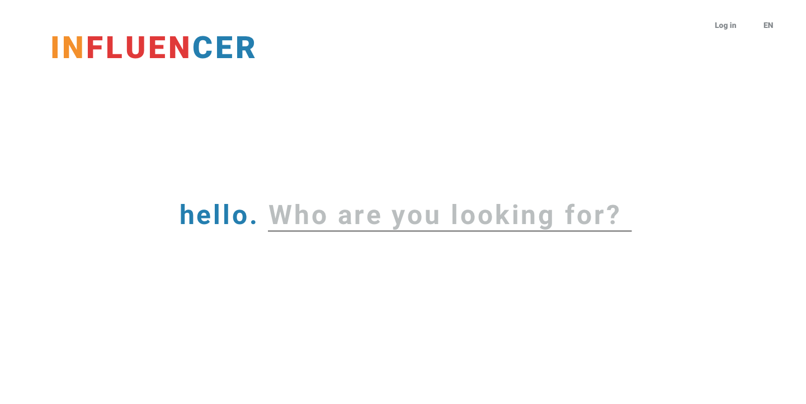
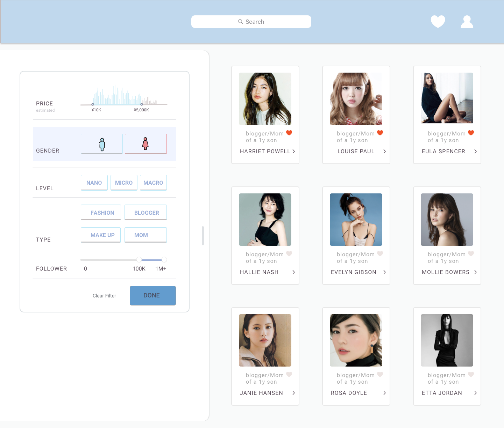
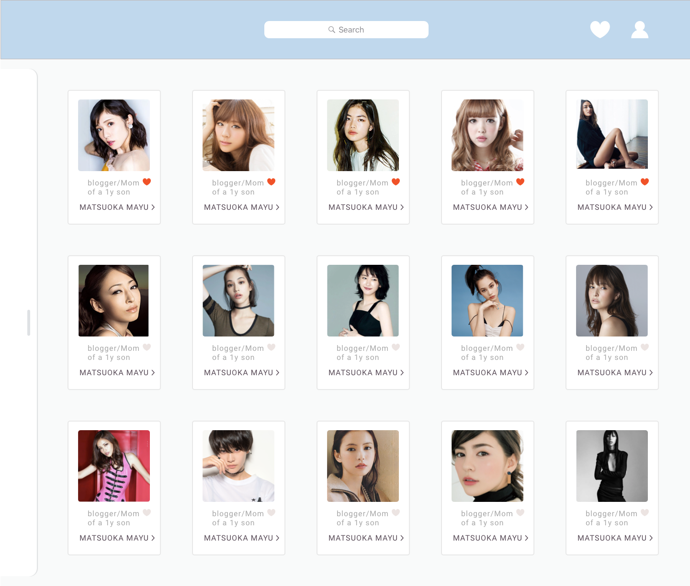

#### JIN is the first Japan influencer network connecting influencers and advertising agencies.

When my partner, who is a back-end developer, reached me out at the beginning, I thought 'This is a pretty cool idea!' We collaborated with a British friend who is living in Tokyo, knows the contact of advertising agency in Japan.

The idea is to create the first Japanese influencer network since most of the search function in advertising industry Japan is oudated. It would be great to add new blood to the industry.

At the beginning, the function is merely search only. This is our very first idea, just a search function for the users to find the influencers that in our database.

We have made many different kind of iterations. This is our very first version, that there are some ideas of what kind of filter we woule like to include, such as price, gender, level of influence, type of focus and followers numbers.

