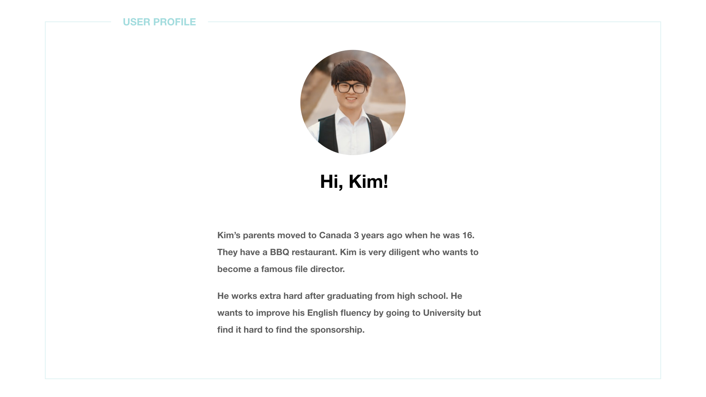
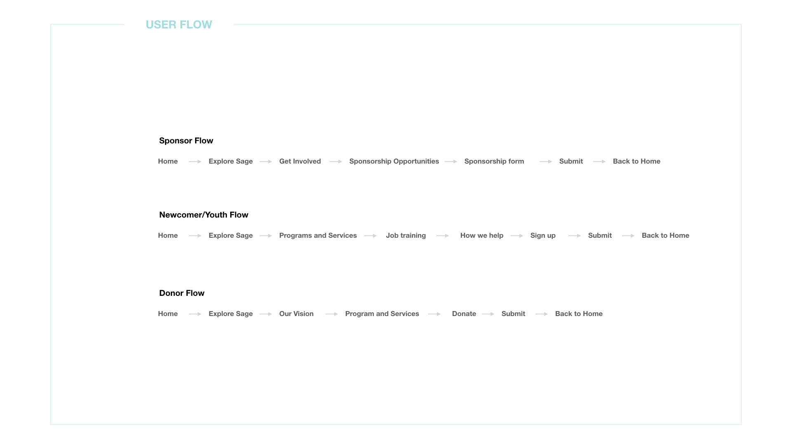
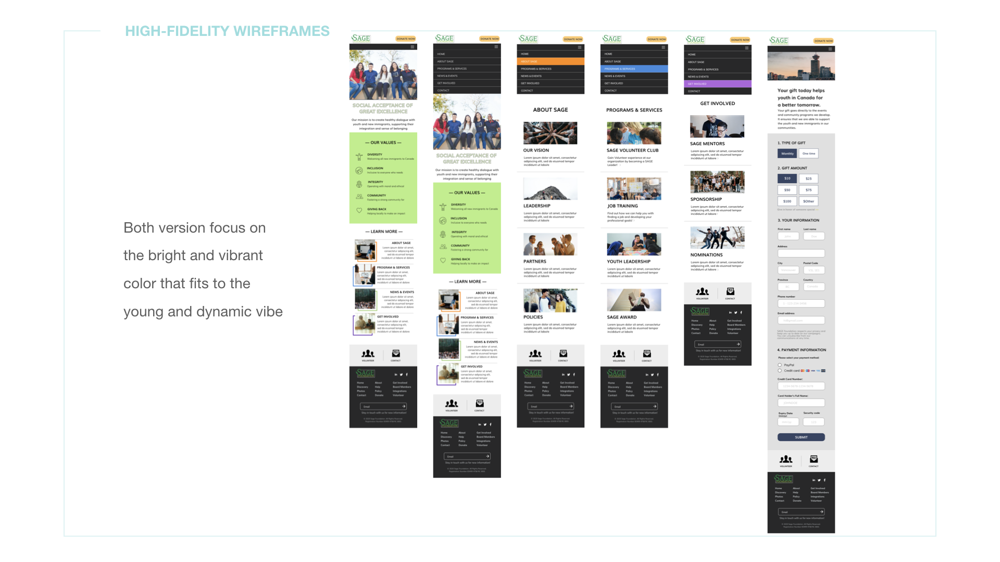

### BRIEF

#### A EXPERIENCE FOR USERS TO FIND SUPPORT AND BELONGINGS

Sage foundation is a NPO aims to provide information and sponsorship for youth immigrant coming to Canada. However, the existing website hasn't been renovated for years. In the project, the goal is to create a more user-friendly platform which will serve as a bridge for both the youth and the doner who would like to make a contribution.

---

### THE PROCESS

#### DEFIND THE PROBLEM USER IS FACING

With the competitive analysis, we found out that Sage foundation website has high bounce rate and low engagement rate. Through the data showns below, we decided to make the website more imageries based to attracted user's attention and add more immigration supporting documents for users to stay longer on the site.

#### UNDERSTAND THE USERS' FEELING

Simulating user's experience can help us find the right users and empathize them. From the project, there are two user profiles created, the youth immigrant- Kim and the doner - Julia, which are both main users of the future website.

#### SIMULATING USERS' ONLINE EXPERIENCE

Understanding what routes users might go through can help us to know what we are missing and what is our MVP.

#### THE GLIMPSE OF THE WIREFRAMES

#### IMPROVE DESIGN THROUGH CONTINUOUS TESTING

Users were asked to play different roles, such as the youth and the doner through the testing. They have to complete the task to fill the sponsorship form for example. After the user testing, I have revised the design according to the feedback. The new design is changed from the drop-down menu to a more imagery-based menu.

#### THE FINAL DESIGN

