### We provide fire prevention interactive app & AI predictive model [DEVPOST](https://devpost.com/software/girls_in_tech_vancouver)

Fireaware is an app provides general public for fire prediction and alert functions.

The visualization fire map shows the locations where has fires right now. Along with it, there is twitter feeds for people to get the latest information.

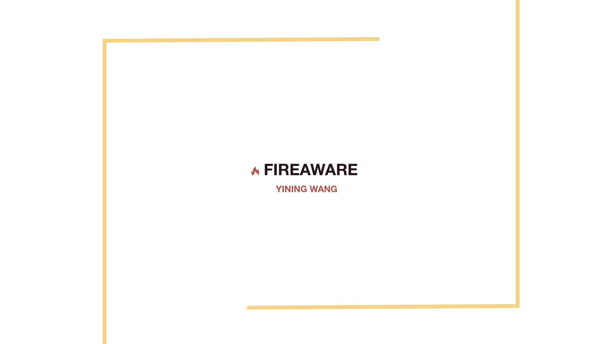

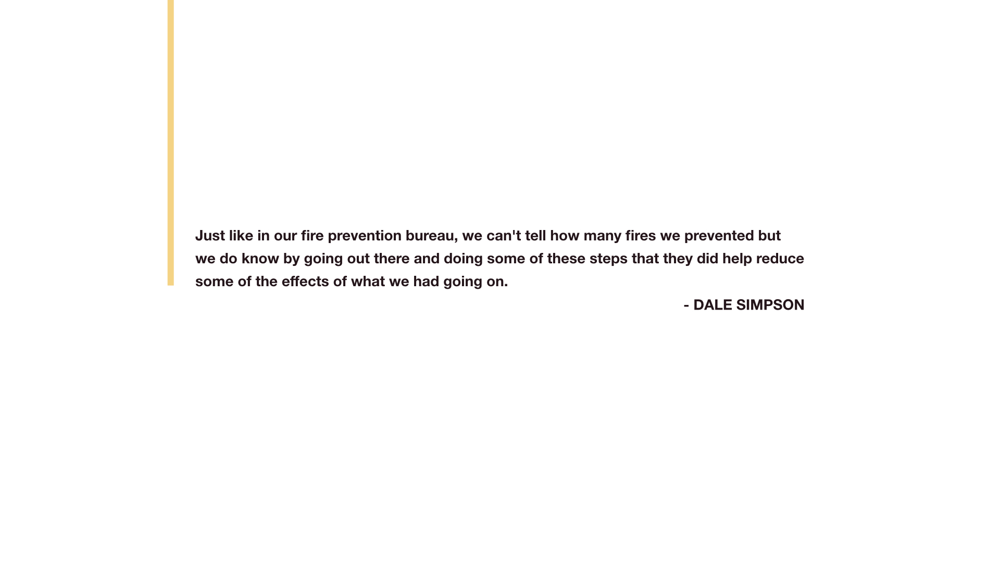

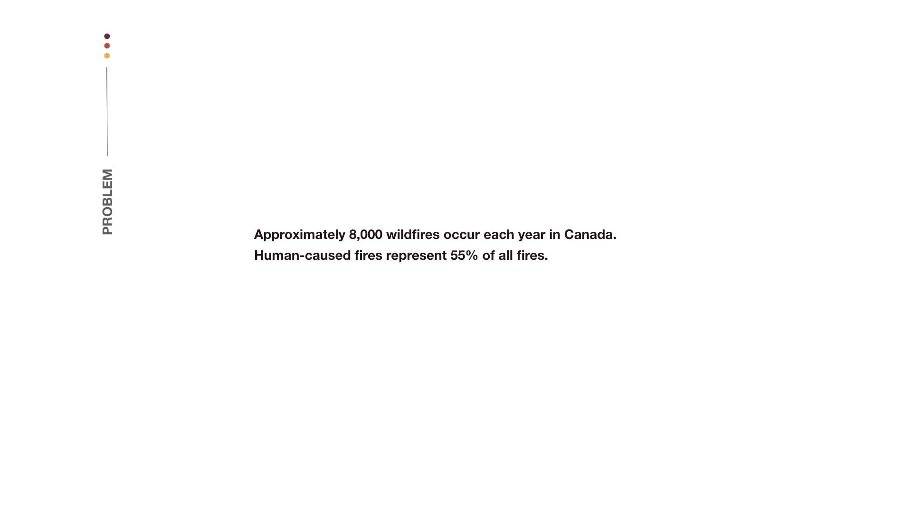

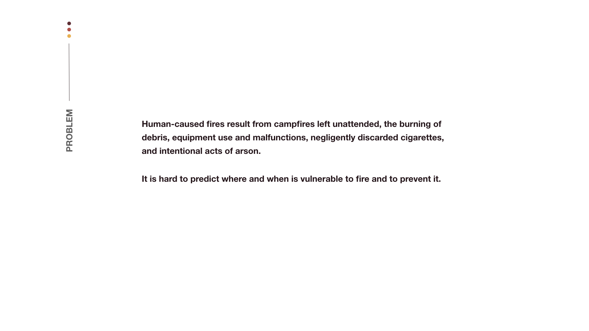

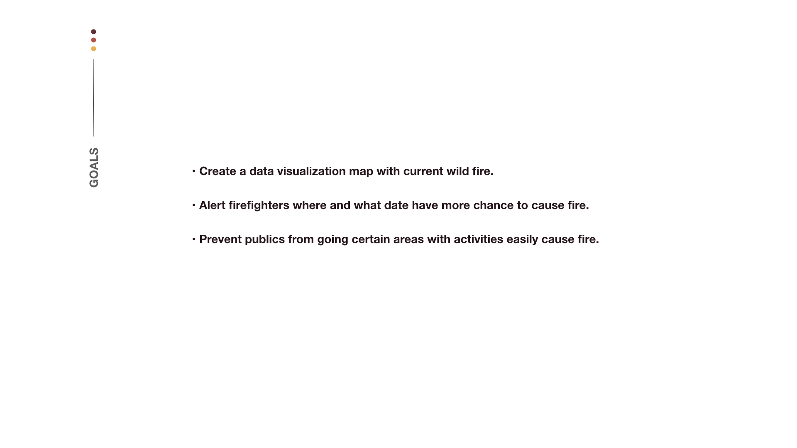

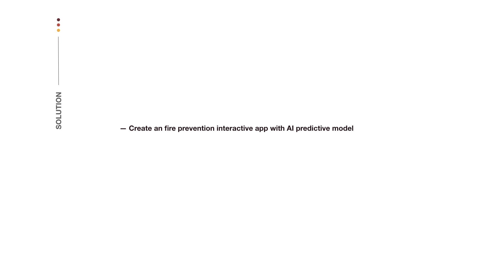

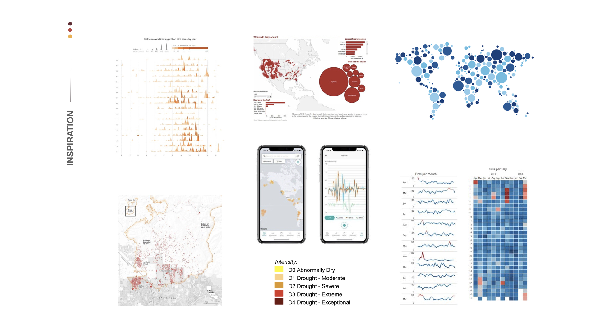

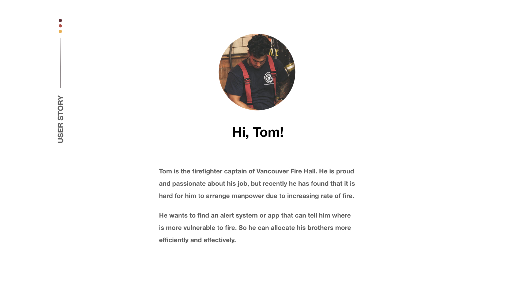

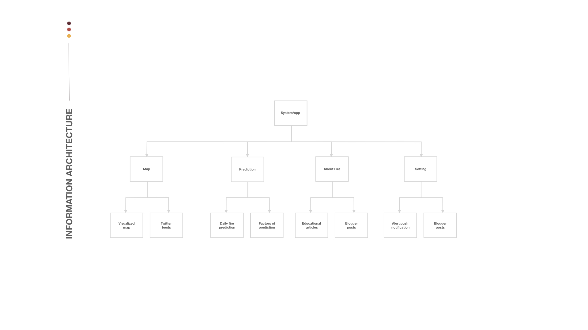

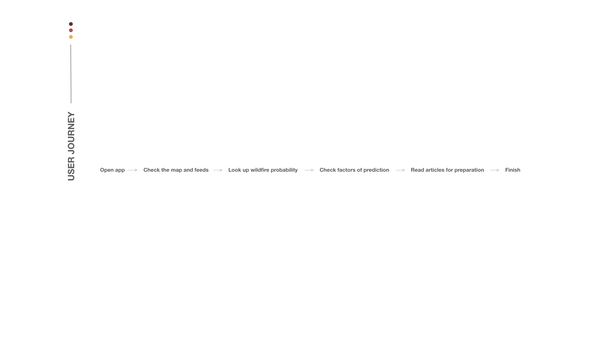

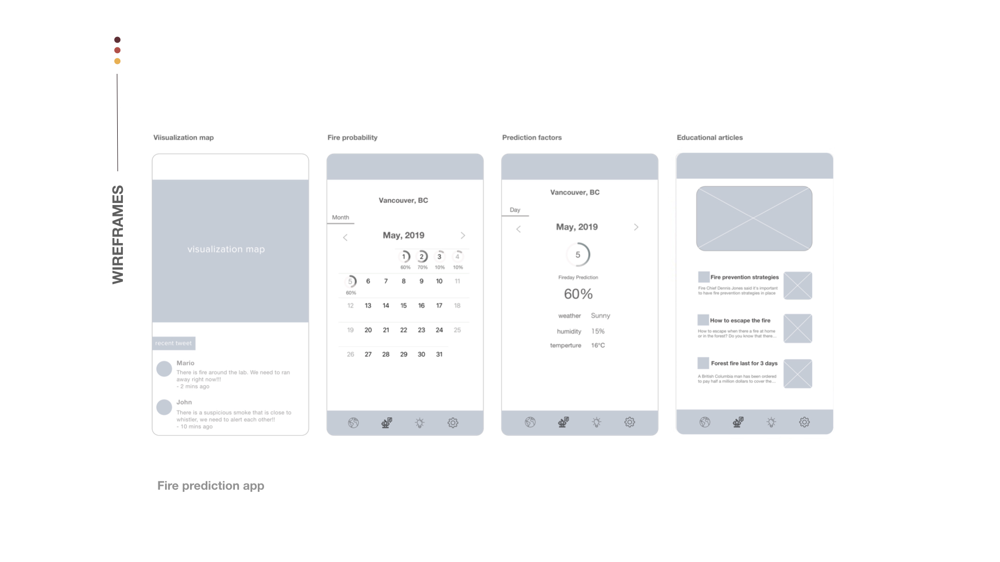

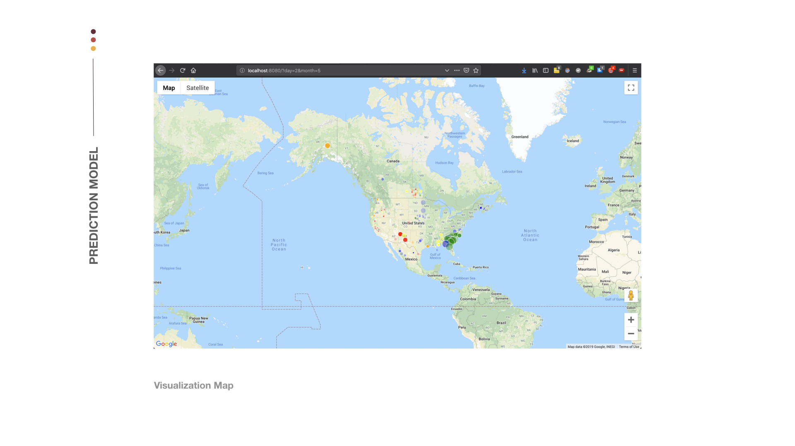

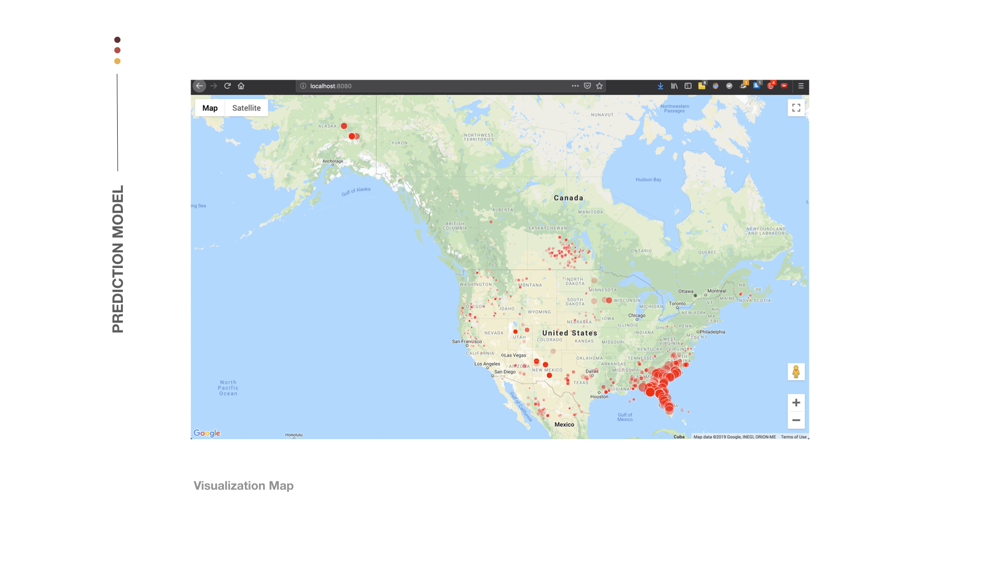

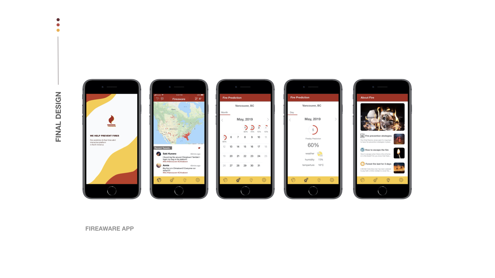

