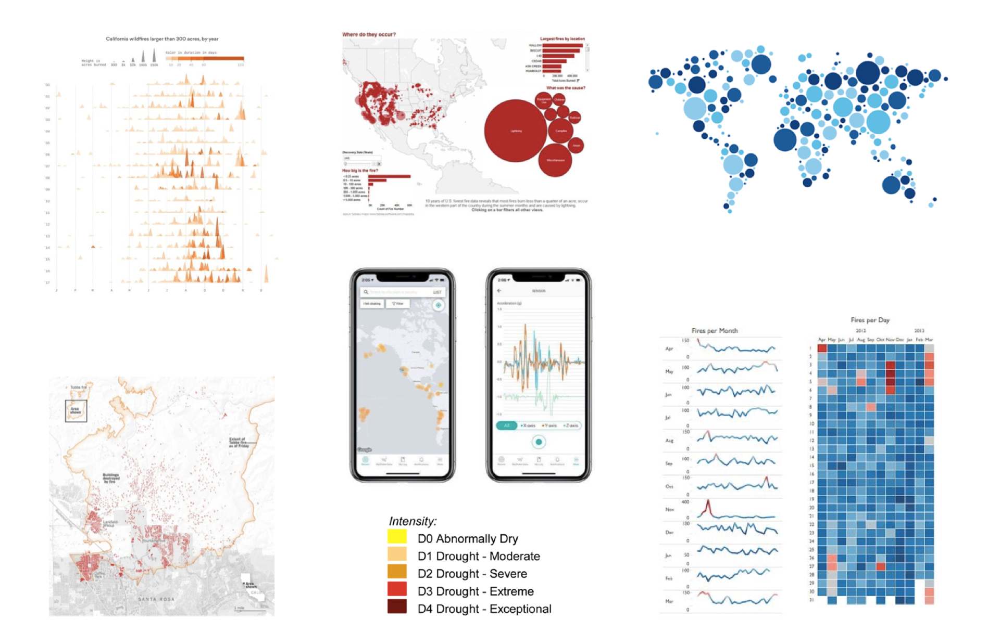
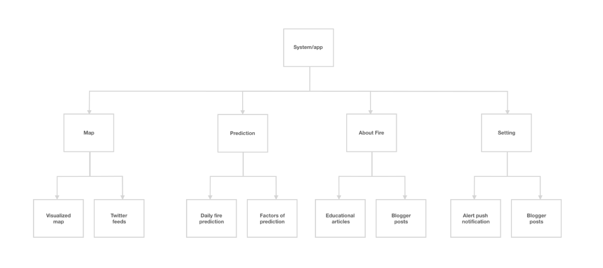
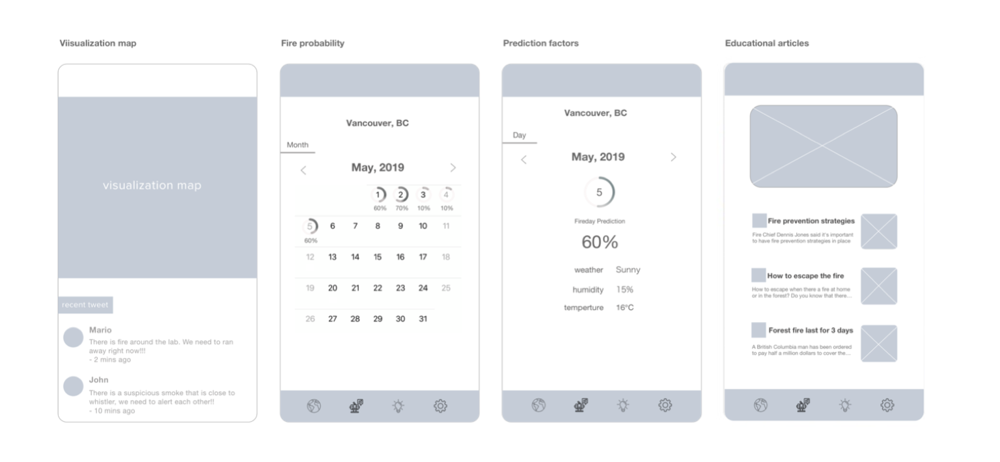
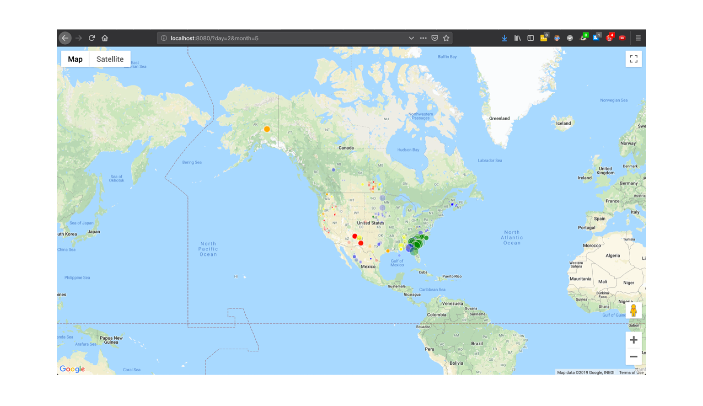
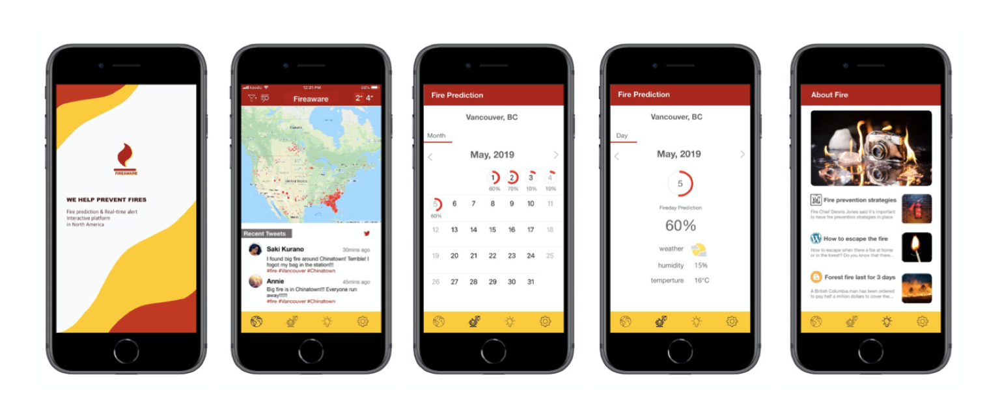

<h1 align="center">

</h1>

#### A Fire Prediction & Real-Time Alert Interactive Platform.

[FIREAWARE](https://devpost.com/software/girls_in_tech_vancouver) is an interactive app that provides firefighters and the public visualization map, AI fire prediction model and alert functions. **This winning project has won Girls in Tech Hackathon in 2019**. It was created in a team of four within 10 hours.

###### Approximately 8,000 wildfires occur each year in Canada. Human-caused fires represent 55% of all fires.

Human-caused fires result from campfires left unattended, the burning of debris, equipment use and malfunctions, negligently discarded cigarettes, and intentional acts of arson. It is hard to predict where and when is vulnerable to fire and to prevent it.

---

##### OUR VISION

- Create a data visualization map with current wild fire.
- Alert firefighters where and what date have more chance to cause a fire.
- Prevent publics from going certain areas with activities easily cause a fire.

###### Therefore, we created a fire prevention interactive app with an AI predictive model.

---

#### RESEARCH PROCESS

I am in charge of the business model and UX/UI design. These are the glimpses of inspiration I got form developing the app.

###### ONLY EMPATHIZE USERS CAN WE CREATE THE PRODUCT IN NEED

###### INFORMATION ARCHITECTURE HELPS US OUTLINE THE STRUCTURE OF THE APP

###### WHAT USER CARE THE MOST IS THE MAP AND THE FIRE PREDICTION FUNCTION

#### APP DESIGN

- When the user enters the site, he/she will see a visualization map that shows what locations have wildfires. We linked API of twitter feeds for the user to get the latest information of the fires.
- The fire probability page shows daily fire prediction in percentage (%) by location they selected. It helps firefighters to be more alert, and users to avoid activities might cause a fire.
- After clicking a day, the user will see factors such as weather, humidity, and temperature determines the fire probability.
- The educational page provides selected articles about fire prevention, news and education.

#### VISUALIZATION MAP

This visualized fire data is based on NASA's satellite images. A day and month can be selected. The circle on the map are proportional to the file size. Their color represents the fire weather index. This tool shows past fire on a given date. The color of the circle shows the given fire weather index on that day, blue is for fwi < 5, green is for 5 < fwi < 10, yellow is for 10 < fwi < 20, orange is for 20 < fwi < 30, and red is for fwi > 30.

 \* The Fire Weather Index (FWI) is a numeric rating of fire intensity. It combines the Initial Spread Index and the Buildup Index. It is suitable as a general index of fire danger throughout the forested areas of Canada. 

#### FINAL DESIGN

#### FIREAWARE TEAM

<h1 align="center">

</h1>
