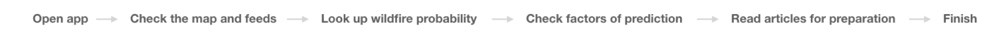

<h3 style="margin-top:100px; text-transform:uppercase">
Hackathon Winning Project 2019
</h3>

<a href="https://devpost.com/software/girls_in_tech_vancouver">FIREAWARE </a>is a <b>Girl's in Tech Hackathon winning project</b> in 2019. It was created by a team of four in 12 hours. FIREAWARE serves as an interactive app that provides both firefighters and the campers an visualized map, AI prediction model for wildfire and real-time alert function.

<h6 style="font-size:16px; margin-bottom:-80px; text-transform:uppercase">
Meet FIREAWARE team </h6>

<body>
      
</body>

<h6 style=" font-size: 16px; margin-bottom:-30px; text-transform:uppercase">
The Challenge </h6>

<h3 style="margin-bottom:20px; text-transform:uppercase">
Put out the difficulty in 12 Hours </h3>

Approximately 8,000 wildfires occur each year in Canada. Human-caused fires represent 55% of all fires. Human-caused fires result from campfires left unattended, the burning of debris, equipment uses and malfunctions, negligently discarded cigarettes, and intentional acts of arson. It is hard to predict where and when is vulnerable to fire and to prevent it.

Our high level goals were to:

1. Make it easy to visualize wildfires for everyone, everywhere.
2. Give firefighters more control over time and money.
3. Create an interative platform for real-time alert and fire prevention.
   

    
    

<h6 style="font-size: 16px; margin-bottom:20px; text-transform:uppercase">
My role 
</h6>

I work with the team to draft FIREAWARE business plan, conduct UX research and create UI/UX design. I collaborated with another designer to create the fire prediction and interactive experience on the app and collaborated with two developers with visualization map and AI prediction model.

We invest about 12 hours and stopped working on the project after the presentation and the price announced.

The app is under developed by <a href="https://quantaloop.com/"> Quantaloop</a>, one of the hackathon sponsors.

---

<h6 style=" font-size: 16px; margin-bottom:-30px; text-transform:uppercase">
Research Process </h6>

<h3 style="margin-bottom:20px; text-transform:uppercase">
Design by conscientious </h3>

I gathered a bunch of visualization maps to give me inspirations that I want to work on. It also helps me to know what kind of maps are more suitable to showcase wildfires' locations.

<h6 style=" font-size: 16px; margin-bottom:-30px; text-transform:uppercase">
User story </h6>

<h3 style="margin-bottom:20px; text-transform:uppercase">
A good problem is one that many thousands of people have </h3>

Wildfires have become endemic around the world, especially in 2019. With limited resources, it is hard for <b>firefighters</b> to find the wildfires in the first place, and to get there timely, sometimes when they arrived, the fire has become too big to put off. To <b>campers</b> who like to cook in the wild, it is hard for them to know what day and where is safer and not vulnerable to forest fires. These people are whom we would like to target to. It is our market niche which has enough users, and the market is solid.

<h6 style=" font-size: 16px; margin-bottom:-30px; margin-top:60px; text-transform:uppercase">
Target User 1</h6>

<h4 style="margin-bottom:20px">
Firefighters need more information to allocate resources efficiently and effectively</h4>

Tom is the firefighter captain of Vancouver Fire Hall. He is proud and passionate about his job, but recently he has found that it is hard for him to arrange manpower due to increasing rate of fire.

He wants to find an alert system or app that can tell him where is more vulnerable to fire. So he can allocate his brothers in a more strategic way.

<h6 style=" font-size: 16px; margin-bottom:-30px; margin-top:60px; text-transform:uppercase">
Target User 2</h6>

<h4 style="margin-bottom:20px">
Campers don't have enough knowledge to camp safely</h4>

Lisa is a student from UBC who loves outdoor activities and go camping with friends especially during summer times. But she heard that there is more and more wildfires going on lately..

She wants to have a fire alert app that can give her information about things she need to know and what she should prepare to prevent fire at the areas she wants to camp.

<h6 style=" font-size: 16px; margin-bottom:-30px; margin-top:60px; text-transform:uppercase">
Information Architecture</h6>

#### The structure provides visualization map, fire alerts, educational info and user settings

<h6 style=" font-size: 16px; margin-bottom:-30px; margin-top:60px; text-transform:uppercase">
user flow</h6>

#### Seamless experience to get the first-hand information

<h6 style=" font-size: 16px; margin-bottom:-30px; margin-top:60px; text-transform:uppercase">
VISUALIZATION MAP</h6>

#### Locate the wildfires timely to act accordingly

This visualized fire data is based on NASA's satellite images. A day and month can be selected. The circle on the map are proportional to the file size. Their color represents the fire weather index. This tool shows past fire on a given date.

<h6 style=" font-size: 16px; margin-bottom:-30px; margin-top:60px; text-transform:uppercase">
LOw-fi wireframes</h6>

#### Start bringing it to life

My approach is to sketch and to white‐board ideas and processes with my teammates. Since I have worked on many existing designs, it was relatively easy to move straight into hi‐fidelity designs later on.

<h6 style=" font-size: 16px; margin-bottom:-30px; margin-top:60px; text-transform:uppercase">
Final design</h6>

#### The below shows some of the app designs for FIREAWARE.

To test an idea, prototyping it is the most effective way. It is crucial to gain feedbacks from users and the judges whom we presented to. We were happy to know that the initial idea proved to be admirable.

#### APP DESIGN

- When the user enters the site, he or she will see a visualization map that shows what locations have wildfires. We linked API of twitter feeds for the user to get the latest information of the fires.
- The fire probability page shows daily fire prediction in percentage (%) by location they selected. It helps firefighters to be more alert, and users to avoid activities might cause a fire.
- After clicking a day, the user will see factors such as weather, humidity, and temperature determines the fire probability.
- The educational page provides selected articles about fire prevention, news and education.

---

  

  
<a href='/kindrednotes'>
       KINDREDNOTES &#8594; 
      </a>

