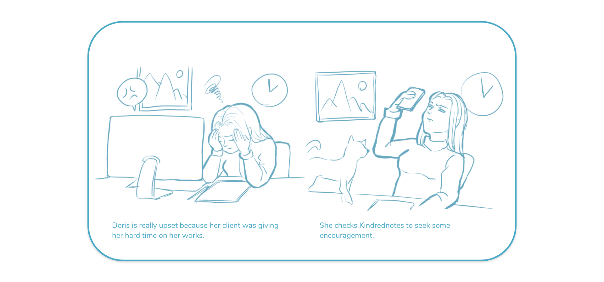
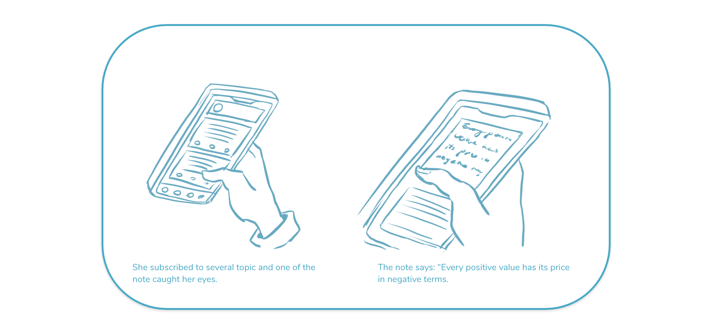
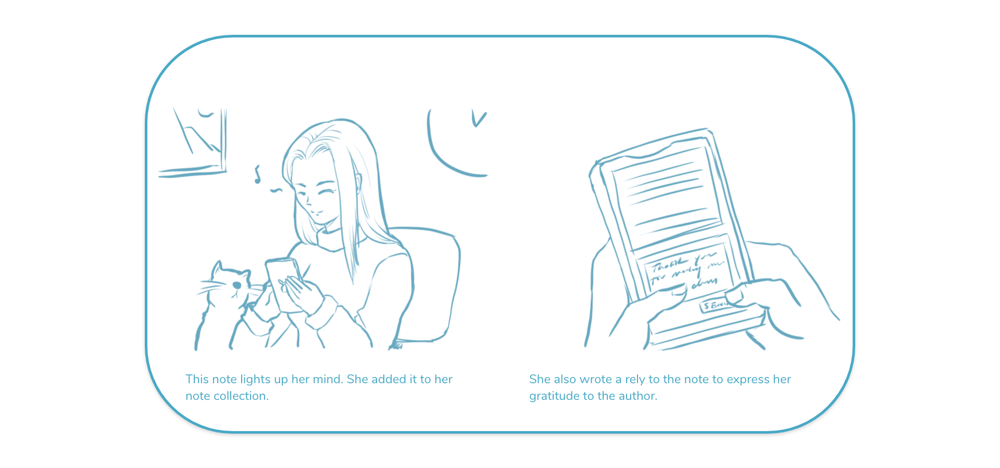
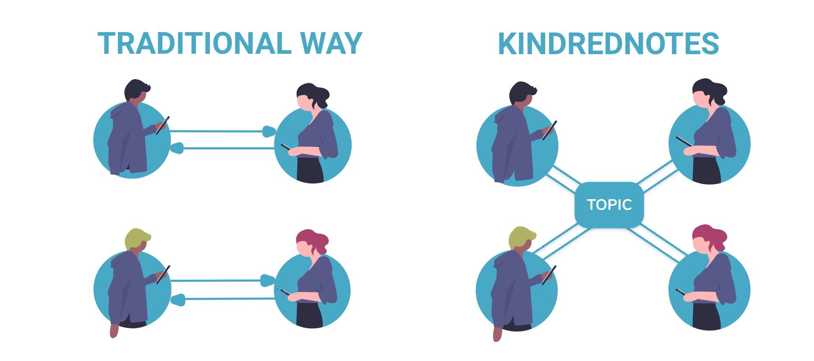
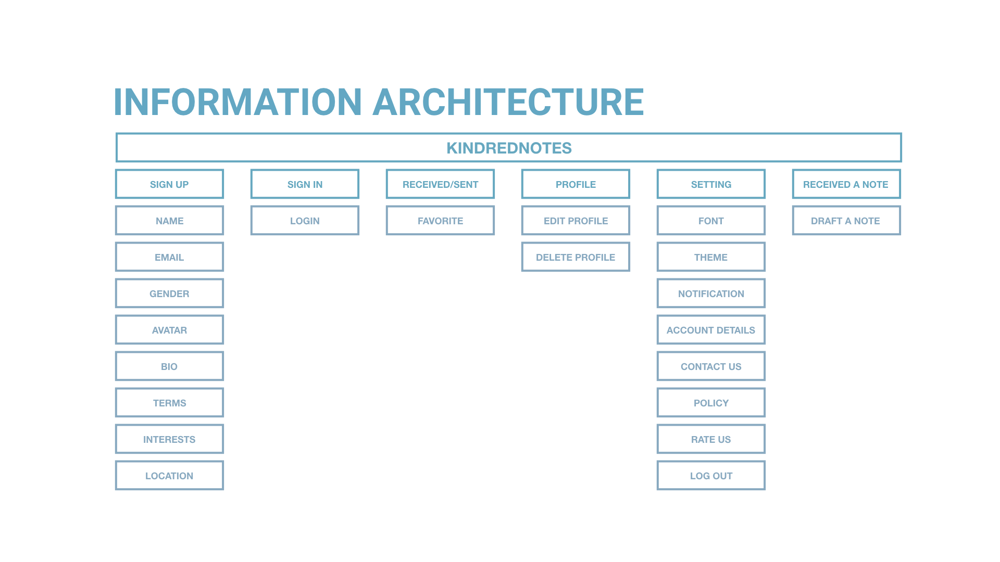
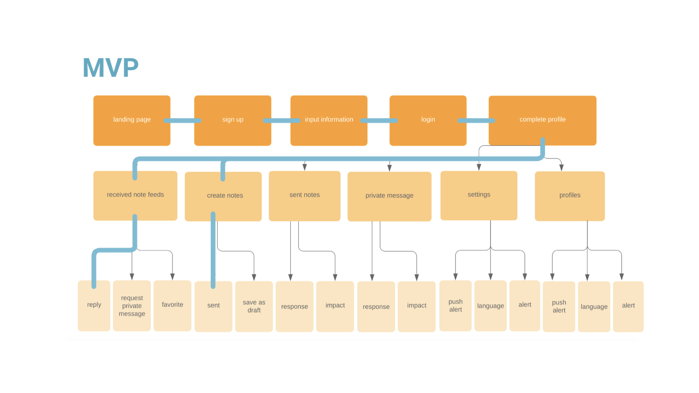
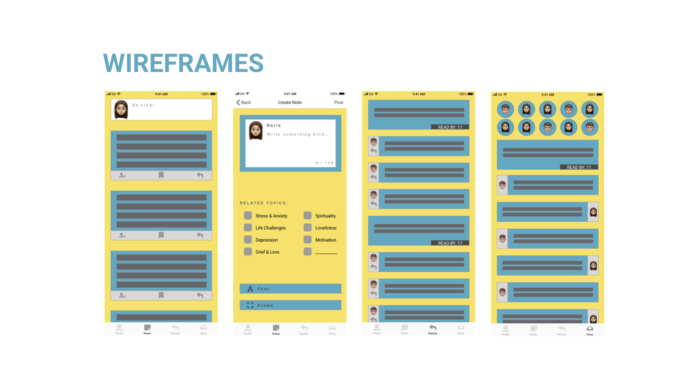
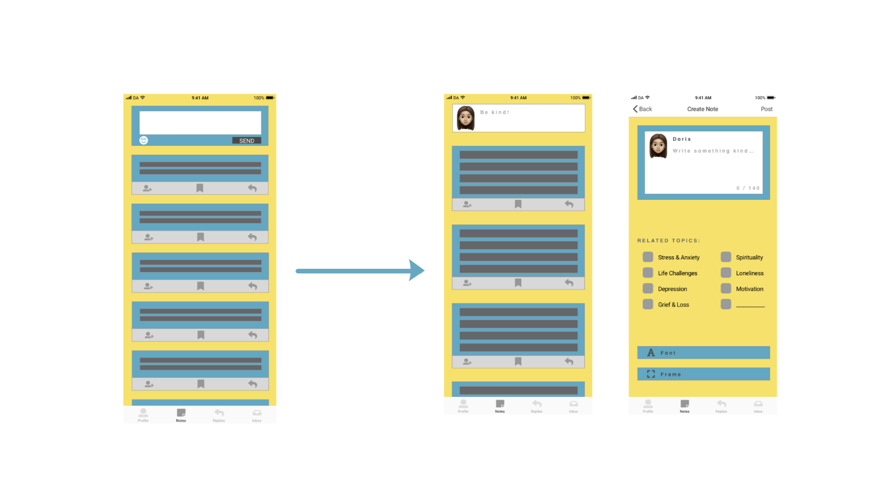
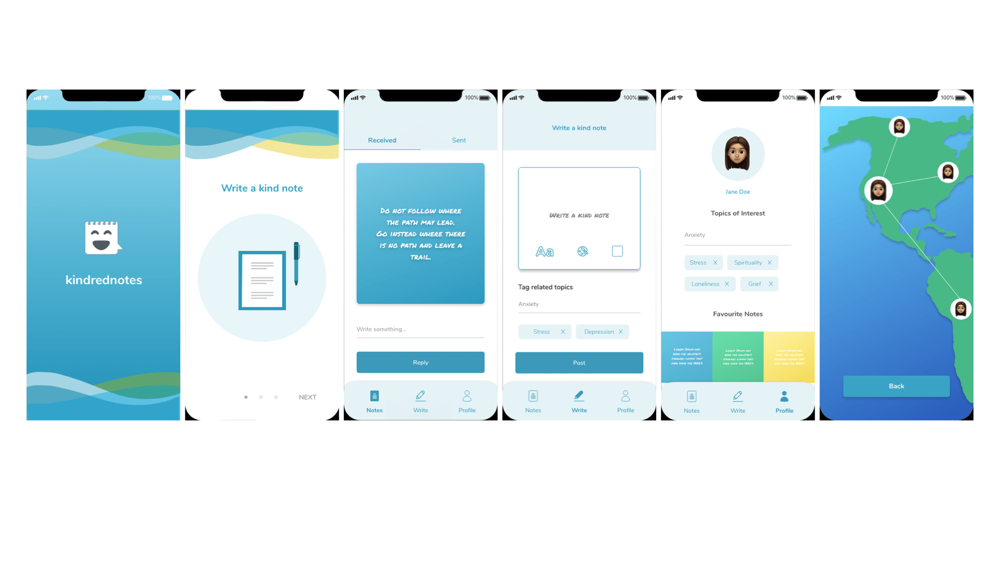

<h1 align="center">

</h1>

> "I was extremely pleased with the results. I would recommend Annie to anyone looking for UI/UX design services." - Shelley Moore Founder of Kindrednotes

---

### BRIEF

#### A MOBILE EXPERIENCE ENABLE USERS SPREAD KINDNESS AT THE FINGERTIPS

Kindrednotes is a Vancouver based start-up that aims to connect people around the world through sending and receiving kind notes. Even though there is already an official website, no functional app is designed for users yet. In the project, the goal is to take a mobile-first approach to design an engaging experience for users.

---

### THE PROCESS

#### DEFIND AND UNDERSTAND USER'S BEHAVIORS

First challenge is to find the liking and behavior of the users, and through 20 responses and 6 interviews, we learn that users fall to the age of 25 to 34, they like to type something short and quick with a positive tone and they would be happy to have a reward system (such as In-App services).

#### IMAGINING THE USERS EXPERIENCE

I focused on creating a user story and user scenario to understand their experience. I wanted to allow users to tell us how they wanted their app delivered. If users can tailor it to fit their mentalities and interests, they are more likely to stick to the service.

<h1 align="center">

</h1>

###### Meet Doris!

Doris is a 26-year-old illustrator who likes to read before going to sleep. She likes her job because she can work from home. However, she **feels lonely sometimes** and **wish someone could encourage her**. One day, after a long day, she especially urged for some comfort. While googling the keyword ‘how to get motivated’, she found Kindrednotes that **for people to spread kindness online**...she was curious and would like to know more...

#### CREATE VALUE WITH IN-DEPTH CONNECTION

Before, people connect to each other but only talk about superficial things. Now, Kindrednotes connects users with topics that they really care. The value of it is through the simple gesture, we can share in-depth understanding with great positivity power, but still able to keep the space and privacy that people need.

---

#### TESTING TO FIND THE TRUE VALUE OF THE PRODUCT

After user testing, there are some improvements made, such as received and sent notes should all go under the same categories. Better to have avatar to recognize which section the user is at. They would like to know the impact of their messages. It is good to have a notification shown that reply is sent successfully, etc.

### FINAL DESIGN

<iframe frameborder="0" scrolling="no" marginheight="0" marginwidth="0"width="788.54" height="443" type="text/html" src="https://www.youtube.com/embed/WAA0SimkEZs?autoplay=0&fs=0&iv_load_policy=3&showinfo=0&rel=0&cc_load_policy=0&start=0&end=0&origin=https://youtubeembedcode.com">
<small><a href="https://youtubeembedcode.com/en">youtubeembedcode en</a></small>

<small><a href="http://add-link-exchange.com">Add-link-exchange</a></small>

<small><a href="https://youtubeembedcode.com/de/">youtubeembedcode de</a></small>

<small><a href="http://add-link-exchange.com">add-link-Exchange</a></small>

<small><a href="https://youtubeembedcode.com/de/">youtubeembedcode.com/de/</a></small>

<small><a href="http://add-link-exchange.com">www://add-link-exchange.com</a></small>

<small><a href="https://youtubeembedcode.com/en">youtubeembedcode.com/en/</a></small>

<small><a href="http://add-link-exchange.com">w://add-link-exchange.com</a></small>

<small><a href="https://youtubeembedcode.com/es/">youtubeembedcode es</a></small>

<small><a href="http://add-link-exchange.com">www://add-link-exchange.com</a></small>

<small><a href="https://youtubeembedcode.com/de/">youtubeembedcode de</a></small>

<small><a href="http://add-link-exchange.com">www://add-link-exchange.com</a></small>
</iframe>
