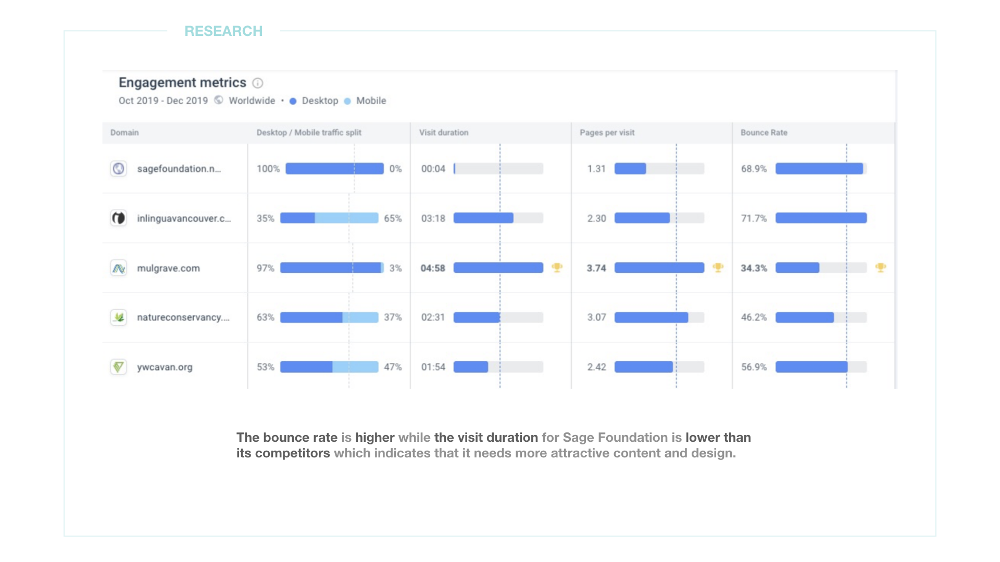

---

<h6 style=" font-size: 16px; margin-bottom:-30px; text-transform:uppercase">
BRIEF </h6>

<h3 style="margin-bottom:20px; text-transform:uppercase">
Bridge the supports with those in needs</h3>

Sage Foundation is an NPO that aims to <b>provide information and sponsorship</b> for <b>youth immigrants</b> coming to Canada. The goal is to revamp the old website and to create a more user-friendly platform which will bridge both the youth and the supporters who would like to contribute.

---

<h6 style=" font-size: 16px; margin-bottom:-30px; text-transform:uppercase">
Research Process </h6>

<h3 style="margin-bottom:20px; text-transform:uppercase">
DEFIND THE PROBLEM THE USERS ARE FACING </h3>

I started with the competitive analysis and found that Sage Foundation website has a high bounce rate and a low engagement rate. Through the data shown below, I made the website more imageries based on attracting users’ attentions and adding more immigration supporting documents for users to stay longer on the site.

<h6 style=" font-size: 16px; margin-bottom:-30px; text-transform:uppercase">
User story </h6>

<h3 style="margin-bottom:20px; text-transform:uppercase">
UNDERSTAND THE USERS' FEELING</h3>

Simulating user experience can help us find the right users and empathize them. From the project, there are two user profiles created, the youth immigrant- Kim and the donor - Julia, which are both main users of the future website.

<h6 style=" font-size: 16px; margin-bottom:-30px; text-transform:uppercase">
User flow </h6>

<h3 style="margin-bottom:20px; text-transform:uppercase">
SIMULATING USERS' ONLINE EXPERIENCE</h3>

Understanding what routes users might go through can help us know what we are missing and what is our MVP.

#### THE GLIMPSE OF THE WIREFRAMES

<h6 style=" font-size: 16px; margin-bottom:-30px; text-transform:uppercase">
User testing </h6>

<h3 style="margin-bottom:20px; text-transform:uppercase">
Testing the user experience through continuous testing</h3>

I asked users to play different roles, such as the youth and the donor, through the testing. They have to complete the task to fill the sponsorship form, for example. After the user testing, I have revised the design according to the feedback. I changed it from the drop-down menu to a more imagery-based menu.

#### THE FINAL DESIGN

  
<a href='/JIN'>
       <b>Japanese Influencer Network</b> &#8594; 
      </a>

