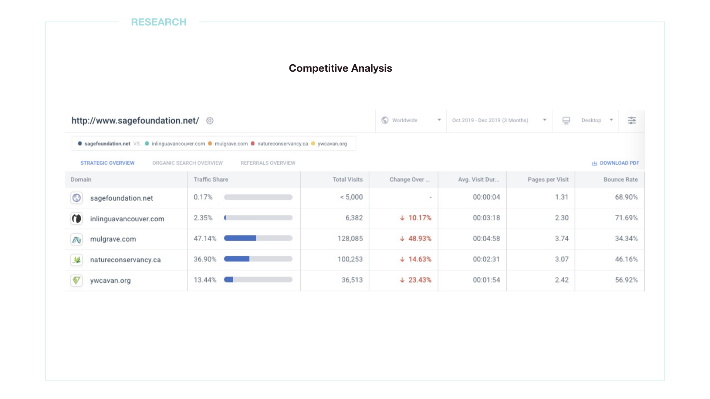

### BRIEF

#### AN EXPERIENCE FOR USERS TO FIND SUPPORT AND BELONGINGS

Sage Foundation is an NPO that aims to provide information and sponsorship for youth immigrants coming to Canada. However, the existing website hasn’t been renovated for years. In the project, the goal is to create a more user-friendly platform which will serve as a bridge for both the youth and the donor who would like to contribute.

---

### THE PROCESS

#### DEFIND THE PROBLEM USER IS FACING

With the competitive analysis, we found that Sage Foundation website has a high bounce rate and a low engagement rate. Through the data shown below, we made the website more imageries based on attracting users’ attention and adding more immigration supporting documents for users to stay longer on the site.

#### UNDERSTAND THE USERS' FEELING

Simulating user experience can help us find the right users and empathize them. From the project, there are two user profiles created, the youth immigrant- Kim and the donor - Julia, which are both main users of the future website.

#### SIMULATING USERS' ONLINE EXPERIENCE

Understanding what routes users might go through can help us know what we are missing and what is our MVP.

#### THE GLIMPSE OF THE WIREFRAMES

#### IMPROVE DESIGN THROUGH CONTINUOUS TESTING

I asked users to play different roles, such as the youth and the donor, through the testing. They have to complete the task to fill the sponsorship form, for example. After the user testing, I have revised the design according to the feedback. I changed it from the drop-down menu to a more imagery-based menu.

#### THE FINAL DESIGN

  
<a href='/JIN'>
       Japanese Influencer Network &#8594; 
      </a>

