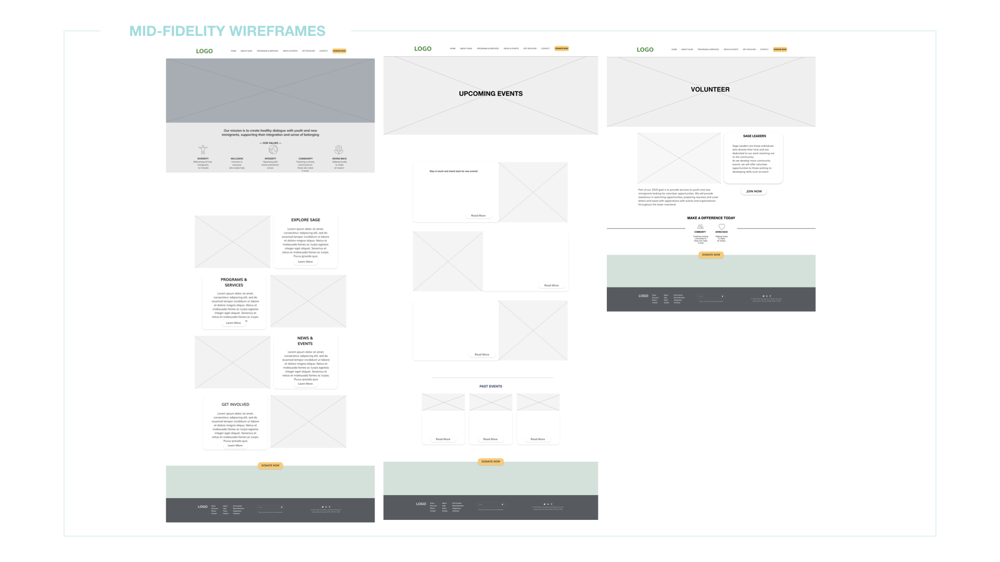

---

<h6 style=" font-size: 16px; margin-bottom:-30px; text-transform:uppercase">
BRIEF </h6>

<h3 style="margin-bottom:20px; text-transform:capitalize">
Bridge the supports with those in needs</h3>

Sage Foundation is an NPO that aims to <b>provide information and sponsorship</b> for <b>youth immigrants</b> coming to Canada. The goal is to revamp the old website and to create a more user-friendly platform which will bridge both the youth and the supporter who would like to contribute.

---

<h6 style=" font-size: 16px; margin-bottom:-30px; text-transform:uppercase">
Research Process </h6>

<h3 style="margin-bottom:20px; text-transform:capitalize">
Define the Problem Users are Facing</h3>

To understand Sage Foundation’s digital marketing place, I started with a competitive analysis. Through the data shown below, we can see that Sage Foundation website has <b>a high bounce rate</b> with <b>a low engagement rate</b>. A high bounce rate means the user would like to leave the page as soon as possible when entering because they did not have a good experience once entering. A low engagement rate means that the users couldn’t find information attractive or useful enough for them to stay.

---

<h6 style=" font-size: 16px; margin-bottom:-30px; text-transform:uppercase">
dig deeper to the problem </h6>

<h3 style="margin-bottom:20px; text-transform:capitalize">
How about we provide users a better navigating experience </h3>

Sage Foundation has two menus at the beginning, which is a bit confusing. Once the user clicks any of the menu, it has little to none imageries with supported texts that provide useful information. To reverse the situation, I tried to cleaned up the menu to make it clearer to navigate with eye-catching images. I also considered adding more immigration supporting information for users so they won’t find the website has nothing much to provide and leave.

<h6 style=" font-size: 16px; margin-bottom:-30px; text-transform:uppercase">
User story 1</h6>

<h3 style="margin-bottom:20px; text-transform:capitalize">
Empathize the Feeling of the Young Immigrants</h3>

Simulating user experience can help us find the right users and empathize them. From the project, there are two user profiles created, the youth immigrant- Kim and the donor - Julia, which are both main users of the future website.

<h6 style=" font-size: 16px; margin-bottom:-30px; text-transform:uppercase">
User story 2</h6>

<h3 style="margin-bottom:20px; text-transform:capitalize">
Understand the inner-side motivation of the supportor</h3>

<h6 style=" font-size: 16px; margin-bottom:-30px; text-transform:uppercase">
User flow </h6>

<h3 style="margin-bottom:20px; text-transform:capitalize">
Simulating Users' Online Experience</h3>

Understanding what routes users might go through can help us know what we are missing and what is our MVP. There are 3 simulation user flows that represent the youth, the sponsor and the donor. 

<h6 style=" font-size: 18px; margin-bottom:-10px; text-transform:uppercase">
1. Newcomer/ The Youth Flow </h6>

<h6 style=" font-size: 16px; margin-bottom:10px; text-transform:capitalize">
Home &#8594; Explore Sage &#8594; Programs and Services &#8594; Job Training &#8594; How We help &#8594; Back home </h6>

<h6 style=" font-size: 18px; margin-bottom:-10px; text-transform:uppercase">
2. Sponsor Flow </h6>

<h6 style=" font-size: 16px; margin-bottom:10px; text-transform:capitalize">
Home &#8594; Explore Sage &#8594; Get Involved &#8594; Sponsorship Opportunities &#8594; Submit &#8594; Back home </h6>

<h6 style=" font-size: 18px; margin-bottom:-10px; text-transform:uppercase">
3. Donor Flow </h6>

<h6 style=" font-size: 16px; margin-bottom:10px; text-transform:capitalize">
Home &#8594; Explore Sage &#8594; Our vision &#8594; donate &#8594; Submit &#8594; Back home </h6>

---

<h6 style=" font-size: 16px; margin-bottom:-30px; text-transform:uppercase">
Lo-fi wireframes </h6>

<h3 style="margin-bottom:20px; text-transform:capitalize">
A Glimpse Of The Initial design</h3>

<h6 style=" font-size: 16px; margin-bottom:-30px; text-transform:uppercase">
User testing </h6>

<h3 style="margin-bottom:20px; text-transform:capitalize">
Optimize the users' experience through continuous testing</h3>

I asked users to play in different roles, such as the youth and the donor. They had to complete the task by filling out the sponsorship form, for example. After the user testings, I have revised the design according to the feedbacks. I changed the design from the original drop-down menu to a more imagery-based menu. It can make users navigate more easily.

<h6 style=" font-size: 16px; margin-bottom:-30px; text-transform:uppercase">
Hi-fi wireframes </h6>

<h3 style="margin-bottom:20px; text-transform:capitalize">
The Final Design of Sage Foundation</h3>

  

  <a href='/age-sister'>
    <b>&#8592; AGE SISTER</b>
  </a>

  
<a href='/JIN'>
       <b>JIN</b> &#8594; 
      </a>

